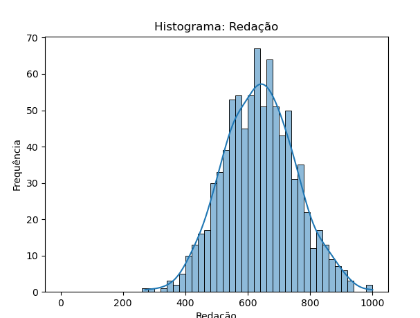
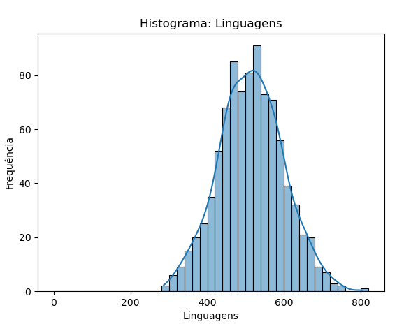
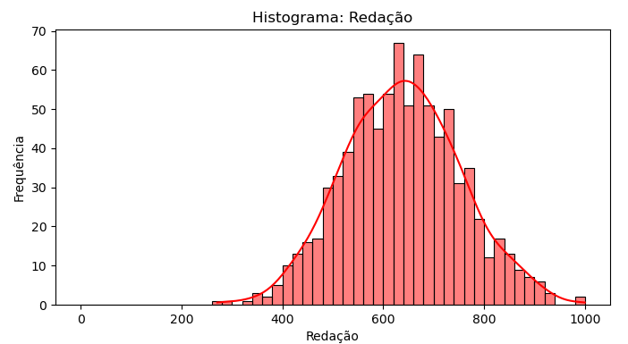
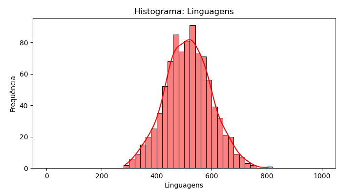
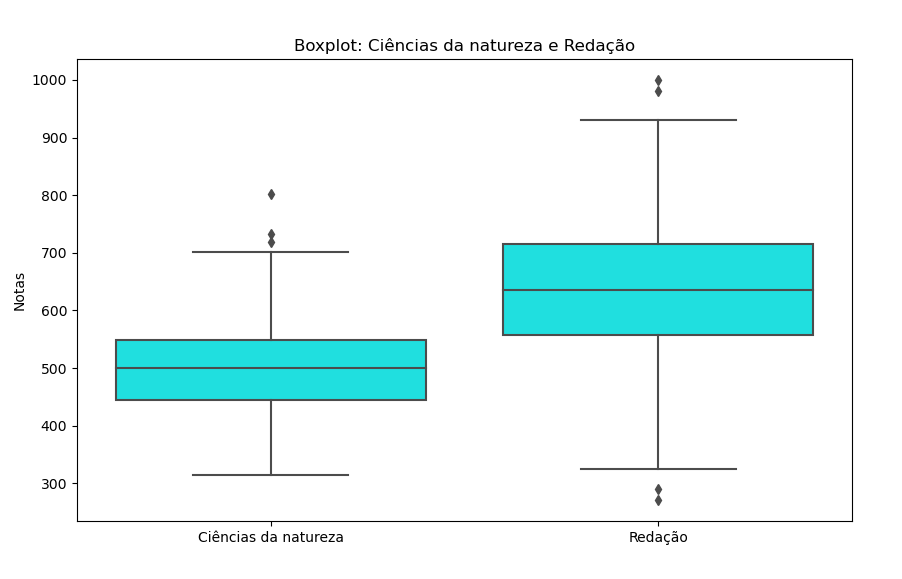

### 6. Faça o histograma de Redação e Linguagens, de 20 em 20 pontos.Podemos dizer que são histogramas simétricos, justifique e classifique se não assimétricas?

### 7.Agora coloque um range fixo de 0 até 1000, você ainda tem a mesma opinião quanto a simetria? plt.hist(dado, bins=_, range=[0, 1000]).

### 8. Faça um boxplot do quartil de todas as disciplinas de ciências da natureza e redação. É possível enxergar outliers? Utilize o método IQR.

